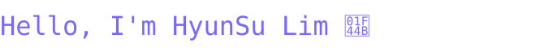

I'm interested in Agentic AI, Computer Vision, and Natural Language Processing.

I received my B.S. in Artificial Intelligence from KNU in 2026, with the distinction of representing the College of Engineering at the degree conferral. I'm currently focused on building practical AI services for real-world applications.

## Tech Stack and Tools

## GitHub Activity

<picture>
  <source media="(prefers-color-scheme: dark)" srcset="https://raw.githubusercontent.com/LimHHSS/LimHHSS/2bfbe977a9cc38a746ae715a3ae32685f0050cee/bomberman-contribution-graph-dark.svg">
  <source media="(prefers-color-scheme: light)" srcset="https://raw.githubusercontent.com/LimHHSS/LimHHSS/2bfbe977a9cc38a746ae715a3ae32685f0050cee/bomberman-contribution-graph.svg">
  
</picture>
